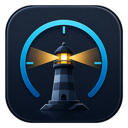
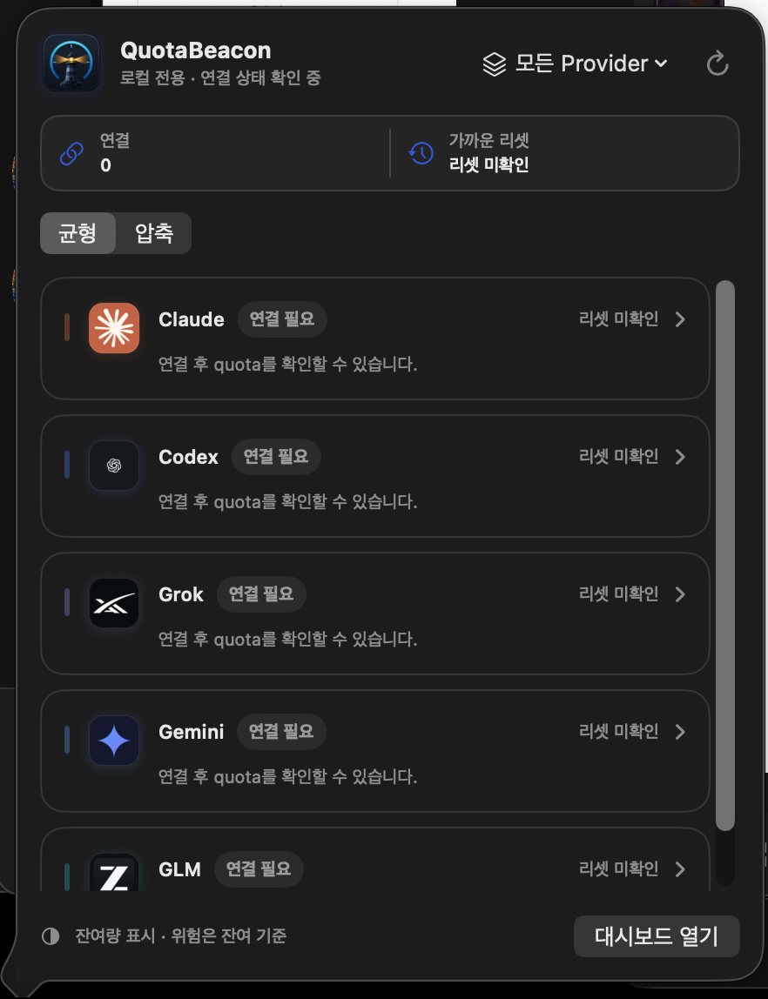
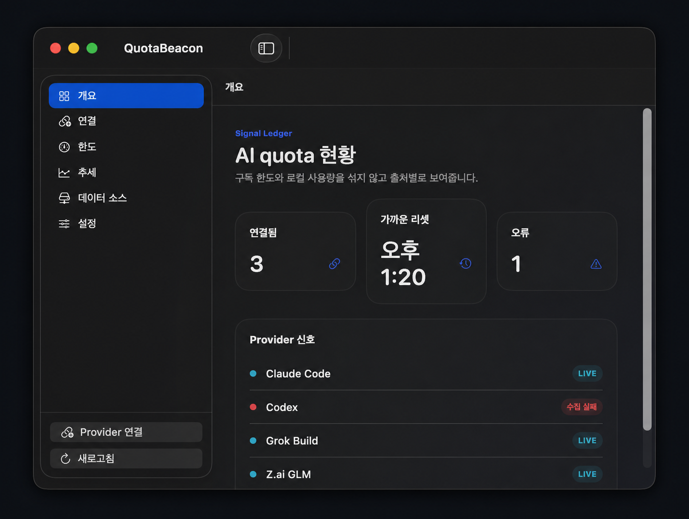
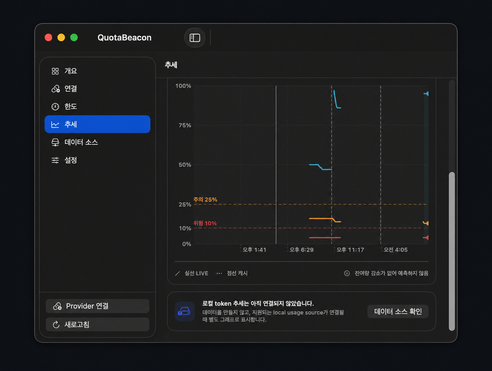
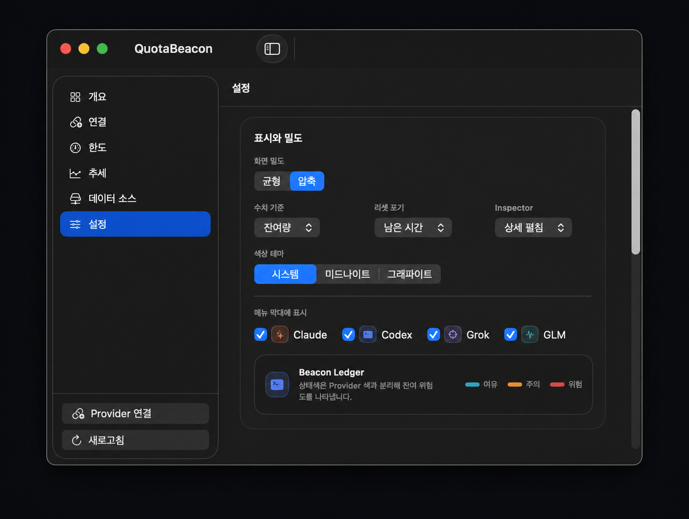
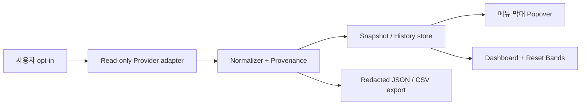

<p align="center">
  <br>
  
</p>

<h1 align="center">QuotaBeacon</h1>

<p align="center"> 
  <strong>AI coding agent의 quota 신호를 한곳에서 읽는 macOS 메뉴 막대 앱</strong><br>
  Claude Code · Codex · Grok Build · Gemini · Z.ai GLM의 구독 한도와 reset을 출처별로 분리해 보여줍니다.
</p>

<p align="center">
  <a href="https://github.com/coreline-ai/agent-quota-monitor/actions/workflows/ci.yml"></a>
  <a href="LICENSE"></a>
  
  
  
  
</p>

<p align="center">
  <a href="#-주요-기능">주요 기능</a> ·
  <a href="#-화면">화면</a> ·
  <a href="#-설치와-실행">설치</a> ·
  <a href="#-provider-연결">연결</a> ·
  <a href="#-보안과-개인정보">보안</a> ·
  <a href="#-라이선스">라이선스</a>
</p>

<p align="center">
  
</p>

> [!IMPORTANT]
> QuotaBeacon은 quota를 **추정하거나 서로 합산하지 않습니다.** 각 Provider가 제공하는 값, 출처, 계약 등급, 관측 시각, freshness, reset을 독립적으로 보존합니다.

## ✨ 주요 기능

| 기능 | 설명 |
|---|---|
| 🛰️ **Beacon Ledger** | 메뉴 막대에서 모든 Provider의 `LIVE`, `부분 데이터`, `캐시`, `연결 필요`, `확인 불가` 상태를 빠르게 확인합니다. |
| 📊 **Quota window** | 5시간·주간·월간 등 서로 다른 한도 창을 분리하고 잔여/사용 기준을 전환합니다. |
| ↻ **Reset Bands** | 24시간·7일·30일 실제 history와 reset 경계, 25% 주의선, 10% 위험선을 함께 표시합니다. |
| 🔌 **명시적 연결** | credential 기반 수집은 기본 비활성화이며 사용자가 **읽기 전용 연결 적용**을 눌러야 시작합니다. |
| 🎛️ **맞춤 표시** | 균형/압축 밀도, 상대/절대 reset, 상세 inspector, 시스템/미드나이트/그래파이트 테마를 지원합니다. |
| 🔐 **로컬 우선** | 자체 서버·telemetry·광고 SDK가 없으며 원본 payload, 프롬프트, 응답, 이메일, 계정 ID를 저장하지 않습니다. |
| 🧭 **Universal macOS** | macOS 14 이상에서 Apple Silicon과 Intel을 모두 지원하는 SwiftUI/AppKit 네이티브 앱입니다. |

## 🖼️ 화면

<table>
  <tr>
    <td width="33%" align="center"><strong>Overview</strong></td>
    <td width="33%" align="center"><strong>Reset Bands</strong></td>
    <td width="33%" align="center"><strong>Appearance</strong></td>
  </tr>
  <tr>
    <td></td>
    <td></td>
    <td></td>
  </tr>
  <tr>
    <td>연결 수, 가까운 reset, 오류와 Provider 신호를 요약합니다.</td>
    <td>LIVE/캐시 선, reset 경계와 위험 구간을 시계열로 구분합니다.</td>
    <td>표시 밀도, 수치 기준, 테마와 Provider 노출을 조정합니다.</td>
  </tr>
</table>

<sub>README 이미지는 실제 macOS 앱을 XCUITest로 캡처한 뒤, 앱 UI는 유지하고 바깥 배경과 외곽만 이미지 편집 도구로 정리했습니다. 화면의 quota와 reset은 캡처 시점에 따라 달라집니다.</sub>

## 🤖 지원 Provider

| Provider | 읽기 경로 | 표시 값 | 계약/상태 |
|---|---|---|---|
| ✦ **Claude Code** | macOS Keychain의 기존 Claude Code access token + Anthropic OAuth usage `GET` | 5시간, 7일, Fable 주간, reset | `observed` · Beta |
| `>_` **Codex** | 공식 `codex app-server`의 `account/rateLimits/read` | primary, secondary, plan, credits, reset | `observed` |
| ◎ **Grok Build** | 검증된 `~/.grok/auth.json` + xAI 공식 CLI billing backend `GET` | 주간/월간 공용 사용률, reset, 선불 잔액 | `observed` · Beta |
| ◆ **Gemini** | 공식 Antigravity CLI `agy`의 `/usage`에서 Gemini 그룹만 격리 | 5시간·주간 잔여율, 선택적 reset | `observed` · Beta |
| 〽 **Z.ai GLM** | 기존 `claude-glm` profile + 설치된 공식 `glm-plan-usage` plugin | 5시간 token, 월간 MCP 사용률 | `observed` · Beta |

`nil`이나 누락 field는 0%로 바꾸지 않습니다. 공개·안정 machine-readable 계약이 없는 값은 임의로 생성하지 않고 typed state로 표시합니다. 상세 계약은 [Provider 계약 기준](docs/provider-contracts.md)을 참고하세요.

## 🧱 동작 구조



- **Adapter**: Provider별 read-only 경로만 호출하고 login, OAuth refresh, 모델 실행, 결제를 수행하지 않습니다.
- **Normalizer**: `ProviderSnapshot`, `QuotaWindow`, `SourceProvenance`로 정규화합니다.
- **History**: 원본 응답 대신 정규화된 ratio와 필요한 metadata만 로컬에 저장합니다.
- **Presentation**: 메뉴 막대와 상세 창이 동일 snapshot을 사용하므로 숫자와 상태 의미가 일치합니다.

## 🚀 설치와 실행

### 요구 사항

- macOS 14 Sonoma 이상
- Xcode 26 이상, Swift 6
- Provider별 기존 공식 CLI 로그인 및 선택적 read-only 연결

### 소스에서 빌드

```zsh
git clone https://github.com/coreline-ai/agent-quota-monitor.git
cd agent-quota-monitor

xcodebuild \
  -project AIQuotaMonitor.xcodeproj \
  -scheme AIQuotaMonitor \
  -configuration Debug \
  -destination 'platform=macOS' \
  build
```

Xcode에서 `AIQuotaMonitor.xcodeproj`를 열고 `AIQuotaMonitor` scheme을 실행해도 됩니다. 제품명과 설치 앱 이름은 **QuotaBeacon**입니다.

### Universal Release 패키지

```zsh
Scripts/build_release.sh
Scripts/package_release.sh
```

현재 로컬 설치/검증용 산출물은 ad-hoc 서명을 사용합니다. 공개 배포에는 Developer ID 서명과 Apple notarization이 별도로 필요합니다. 자세한 절차는 [배포 가이드](docs/distribution.md)를 확인하세요.

## 🔌 Provider 연결

1. 메뉴 막대의 QuotaBeacon을 열고 **대시보드 열기**를 누릅니다.
2. 왼쪽 사이드바의 **연결** 또는 **Provider 연결**을 선택합니다.
3. 자동 탐지된 경로와 상태를 확인합니다.
4. 사용할 Provider toggle을 켜고 **읽기 전용 연결 적용**을 누릅니다.
5. 새로고침 후 `LIVE`, source, observed time과 quota window를 확인합니다.

| Provider | 연결 전 준비 | QuotaBeacon이 하지 않는 일 |
|---|---|---|
| Claude | Claude Code 로그인 | refresh token 사용, statusLine 수정, 브라우저 cookie import |
| Codex | Codex CLI 로그인 및 실행 파일 탐지 | login/logout, thread/model method, credit 소비 |
| Grok | `grok login`, credential file mode `0600` | refresh token 사용, auto-topup, WebView 수집 |
| Gemini | `agy` 로그인 후 신뢰된 workspace에서 `/usage` 확인 | OAuth 파일·내부 endpoint 접근, Claude/GPT 그룹 저장, 모델 prompt 전송 |
| GLM | `claude-glm` profile과 공식 plugin 설치 | shell profile 실행, plugin 복제, Model/Tool usage 저장 |

> [!NOTE]
> Gemini는 개인 Gemini CLI의 현재 Antigravity 이전 정책에 맞춰 공식 `agy /usage`만 사용합니다. GLM은 공식 plugin이 출력하는 quota section만 읽습니다. CLI/plugin/profile 미설치, 계정 정책, output drift가 있으면 수치를 추정하지 않고 연결 상태와 진단만 보여줍니다.

## 🔐 보안과 개인정보

- credential 기반 Provider는 기본적으로 꺼져 있습니다.
- credential은 허용된 위치에서 읽고 메모리에서만 최소 field를 선택합니다.
- HTTPS redirect, cookie 저장, response cache를 거부하며 요청 timeout과 backoff를 적용합니다.
- 원본 Provider payload, token, 프롬프트/응답, 이메일, 계정 ID, 홈 경로는 history와 export에 저장하지 않습니다.
- 자체 backend, 원격 telemetry, crash reporter, 분석 SDK가 없습니다.
- Bundle ID는 `ai.coreline.quotabeacon`이며 이전 개인 빌드의 안전한 표시/연결 설정만 최초 실행 시 한 번 로컬 이전합니다.

자세한 위협 모델과 삭제 방법은 [보안·개인정보 설계](docs/security-privacy.md)를 참고하세요.

## 🧪 검증

```zsh
# Unit/UI test
xcodebuild \
  -project AIQuotaMonitor.xcodeproj \
  -scheme AIQuotaMonitor \
  -destination 'platform=macOS' \
  test

# Fixture, originality, security, release audit
Scripts/ProviderProbe/fixture_guard.py scan
python3 Scripts/ProviderProbe/test_safe_validation.py
python3 Scripts/ProviderProbe/test_claude_oauth_usage_probe.py
python3 Scripts/ProviderProbe/test_grok_billing_probe.py
python3 Scripts/ProviderProbe/test_glm_plugin_usage_probe.py
python3 Scripts/ProviderProbe/test_gemini_cli_quota_probe.py
Scripts/audit_originality.sh
Scripts/security_audit.py
Scripts/verify_release.sh /path/to/QuotaBeacon.app
```

CI는 pull request와 push에서 Greenfield reference audit, Debug/Release build, unit test를 실행합니다.

## 📁 프로젝트 구조

```text
AIQuotaMonitor/
├── Application/      # 앱 수명주기, refresh coordinator, local history
├── Domain/           # snapshot, quota window, provenance, typed state
├── Providers/        # Claude, Codex, Grok, Gemini, Z.ai read-only adapters
├── Features/         # MenuBar, Overview, Limits, Trends, Settings
├── DesignSystem/     # theme, density, quota presentation
└── Security/         # redaction, credential/path validation
AIQuotaMonitorTests/  # domain, adapter, security unit tests
AIQuotaMonitorUITests/# menu-bar/dashboard XCUITest
Scripts/              # probes, audits, release/package tooling
docs/                 # architecture, security, contracts, QA evidence
```

## 📚 문서

- [아키텍처](docs/architecture.md)
- [제품 범위](docs/product-scope.md)
- [Provider 계약](docs/provider-contracts.md)
- [Provider 실환경 검증](docs/provider-validation-2026-08-16.md)
- [Grok·Gemini 추가 검증](docs/provider-validation-2026-08-17.md)
- [보안·개인정보](docs/security-privacy.md)
- [배포 가이드](docs/distribution.md)
- [외부 참조 등록부](docs/reference-register.md)
- [정본 개발 계획](dev-plan/implement_20260816_133341.md)
- [Grok 계약·Gemini CLI 확장 계획](dev-plan/implement_20260817_155407.md)

## 🌱 독립 구현

QuotaBeacon은 Greenfield 방식으로 독립 구현되었습니다. 외부 오픈소스와 제품의 source code, fixture, UI 구조, build script를 복사하지 않았으며 `Scripts/audit_originality.sh`와 CI reference audit로 경계를 검사합니다. Provider 식별용 소형 브랜드 마크만 출처·상표 경계를 명시해 포함하며 자세한 내용은 [브랜드 자산 출처](BrandAssets/README.md)를 확인하세요.

## 📄 라이선스

[MIT License](LICENSE) © 2026 [Coreline-ai](https://github.com/coreline-ai)

외부에 별도로 설치되는 Antigravity CLI와 선택적 GLM plugin 등은 각 제품·프로젝트의 약관과 라이선스를 따르며 QuotaBeacon에 복사·링크·번들되지 않습니다. 자세한 내용은 [Third-Party Notices](THIRD_PARTY_NOTICES.md)를 확인하세요.
