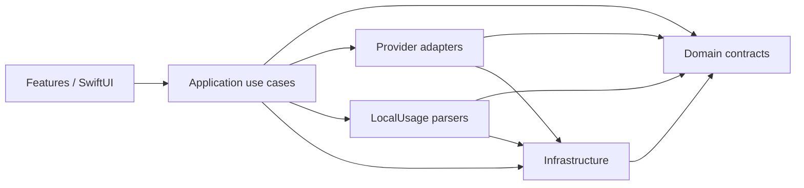

# AIQuotaMonitor 아키텍처

작성일: `2026-08-16 KST`

## 환경 기준선

- Xcode: `26.2 (17C52)`
- Swift: `6.2.3`
- 개발 장비 OS: `macOS 26.5.2`
- deployment target: `macOS 14.0`
- project: 신규 `AIQuotaMonitor.xcodeproj`
- 외부 package dependency: 없음

## 아키텍처 목표

- UI, domain, side effect, Provider 구현을 분리한다.
- Provider별 불안정한 계약이 공통 모델과 화면으로 누출되지 않게 한다.
- quota와 local usage를 독립 pipeline으로 유지한다.
- 값별 provenance와 freshness를 보존한다.
- 테스트가 실제 credential이나 network 없이 fixture로 동작하게 한다.

## 계층

## 의존 규칙

- `Domain`은 AppKit, SwiftUI, Provider, filesystem 구현에 의존하지 않는다.
- `Infrastructure`는 Domain protocol을 구현한다.
- `Providers`는 Domain model과 Infrastructure abstraction만 사용한다.
- `LocalUsage`는 remote quota API를 호출하지 않는다.
- `Features`는 credential path와 원본 response를 알지 못한다.
- `Application`이 실제 구현을 조립하고 수명주기를 관리한다.

## 구현 상태

현재 구현은 다음 계층을 제공한다.

- accessory activation policy
- 신규 `QuotaBeaconStatus` template asset 기반 status item과 왼쪽 popover/오른쪽 menu
- `QuotaRatio`, window provenance/freshness, typed state/error, last-known-good merge
- cancellation/timeout HTTP·Process 경계와 read-only credential validator/Keychain
- versioned JSON history, 90일·25 MiB retention, Provider별 single-flight refresh
- Claude Keychain OAuth usage GET adapter와 선택적 statusLine snapshot parser, Codex 공식 app-server read-only adapter
- Grok 공식 CLI billing backend와 Z.ai 공식 `glm-plan-usage` plugin 기반 `observed · Beta` adapter, 네 Provider 독립 synthetic parser fixture
- quota chart와 local token/cost chart를 분리한 5-section Signal Ledger dashboard
- `TrendPresentation`의 기간 filter·Provider/window/reset grouping·freshness segment·bucket downsample과 Swift Charts `Reset Bands` 선 그래프
- 공통 `QuotaPresentation`·`BeaconComponents`를 사용하는 Beacon Ledger popover와 한도 원장
- AppStorage 기반 밀도·metric·reset·theme·inspector·Provider 표시 설정
- redacted JSON/CSV export, notification threshold dedupe, SMAppService login item
- 한국어 기본 UI와 영어 resource fallback

Provider credential 접근은 기본 비활성화되어 있으며 설정의 명시적 승인 후에만 조립된다.

## 빌드 구성

- `Config/Shared.xcconfig`: 공통 deployment, Swift, 제품 identity
- `Config/Debug.xcconfig`: debug 최적화와 조건
- `Config/Release.xcconfig`: whole-module release 최적화
- Swift source compiler warning은 오류로 처리하고, Xcode toolchain 자체 warning은 별도 추적한다.
- signing 값은 저장소에 넣지 않는다.
- Team ID는 저장소에 두지 않고 Developer ID 서명 단계에서 CI secret으로 주입한다.

## 테스트 전략

- Unit: Domain invariant와 Infrastructure boundary
- Provider: 직접 수집하고 redaction한 fixture parser
- Feature: view model과 상태 집계
- UI: 메뉴·dashboard·설정의 핵심 사용자 흐름
- Release: 서명, 공증, clean install, update, idle 성능

GUI 회귀는 실제 `NSPopover`를 여는 XCUITest와 dashboard navigation XCUITest로 분리한다. 테스트 환경에서만 status item의 popover를 자동 표시하며, production activation policy와 사용자 클릭 경로는 변경하지 않는다. 팝오버의 SwiftUI 접근성 자식은 macOS ControlCenter bridge에서 제한될 수 있어, 존재·클릭·요약/상세 렌더 변화와 보존 스크린샷을 함께 검증한다.

## Phase 1 결정 기록

| 결정 | 값 | 근거 |
|---|---|---|
| Xcode project | 직접 생성 | Greenfield 원칙과 native release pipeline |
| 상태바 | AppKit `NSStatusItem` | 양쪽 클릭과 popover/window 제어 |
| UI | SwiftUI | macOS 14와 접근성 지원 |
| external package | 없음 | 최소 기반과 라이선스 단순화 |
| 표시 이름 | `QuotaBeacon` | quota 상태를 조용히 알리는 메뉴바 beacon이라는 제품 역할 |
| Bundle ID | `ai.coreline.quotabeacon` | Coreline-ai reverse-DNS identity |
| 디자인 언어 | `Signal Ledger` | quota·local usage를 분리한 계측 중심 표현 |
| app/menu icon | 신규 생성 asset | 두 reset window와 하나의 live signal을 결합한 독립 형상 |
| signing | 로컬 ad-hoc, 배포 Team ID는 Phase 7 주입 | credential을 저장소에 기록하지 않음 |
| compiler warning | source warning 0건 | `SWIFT_TREAT_WARNINGS_AS_ERRORS=YES` |

## 런타임 흐름

1. `AppDelegate`가 shared `QuotaMonitorModel`과 status/dashboard controller를 조립한다.
2. `QuotaMonitorModel`은 저장된 opt-in 설정만으로 Provider adapter를 만든다. Claude/Grok이 비활성화된 경우 Keychain/auth file 접근이나 network request는 발생하지 않는다.
3. `RefreshCoordinator`가 Provider별 single-flight task를 실행하고 한 Provider 실패를 격리한다.
4. `SnapshotStore`가 부분 결과를 last-known-good와 병합하되 이전 값은 `stale`로 바꾼다.
5. menu/dashboard는 `ProviderSnapshot`만 소비하며 credential path나 원본 payload를 보지 않는다.
6. popover가 보이면 60초, 일반 상태 5분, 실패 시 15/60분 backoff를 적용한다.

## 추세 표시 흐름

1. `QuotaMonitorModel.history`의 정규화된 `ProviderSnapshot`만 `TrendPresentation`에 전달한다.
2. 선택한 24시간·7일·30일 cutoff로 관측값을 제한하고 Provider와 `QuotaWindowKind`를 안정적인 series key로 만든다.
3. countdown 기반 reset timestamp의 sub-second 흔들림은 reset minute identity로 정규화한다. 실제 reset cycle, freshness 변화, 기간별 최대 gap은 각각 별도 line segment가 된다.
4. 24시간·7일·30일에 맞는 bucket으로 first·minimum·last point를 보존해 mark 수를 제한한다.
5. 화면은 linear `LineMark`, 최신 `PointMark`, 주 series의 옅은 `AreaMark`, 25%·10% `RuleMark`, 과거 reset `RectangleMark`를 그린다.
6. pace는 현재 reset instance의 fresh 표본만 사용하며 3개 미만, 감소 없음, reset 전 소진 없음 상태를 수치 예측과 구분한다.
7. quota와 local token은 서로 다른 surface를 유지하며 local source가 없으면 연결 안내만 표시한다.

## Grok read-only 흐름

1. 사용자가 Grok Beta 연결을 켜고 `~/.grok/auth.json` 경로를 승인한다.
2. `GrokCredentialReader`가 symlink를 거부하고 regular file·owner·allowlist·`0600`·expiry를 검증한다.
3. access token과 user ID만 메모리에서 선택하며 refresh token은 선택·사용·전송하지 않는다.
4. `GrokBillingProvider`가 `https://cli-chat-proxy.grok.com/v1/billing?format=credits`에 GET을 보내고 redirect·cookie·cache를 거부한다.
5. `GrokQuotaParser`가 사용률·기간·reset·선불 잔액만 공통 domain으로 정규화하며 원본 payload와 계정 정보는 저장하지 않는다.

## Claude read-only 흐름

1. 사용자가 Claude 연결을 켜면 별도 경로 없이 기존 Claude Code 로그인을 사용한다.
2. `ClaudeKeychainCredentialReader`가 `/usr/bin/security`로 service `Claude Code-credentials`, 현재 macOS account의 generic password를 읽고 `claudeAiOauth.accessToken`만 선택한다.
3. `ClaudeOAuthUsageProvider`가 Anthropic OAuth usage allowlist URL에 GET을 보내고 redirect·cookie·cache를 거부한다. refresh token·모델 endpoint·login/logout은 사용하지 않는다.
4. `ClaudeOAuthUsageParser`가 5시간·7일·Fable 주간 window만 공통 domain으로 정규화한다. 원본 payload와 credential은 저장하지 않는다.
5. 성공 결과는 180초 재사용하고 429에서는 backoff한다. 이 계약은 `observed · Beta`이며 기존 statusLine은 수정하지 않는다.

## Z.ai GLM official plugin 흐름

1. 사용자가 연결 화면에서 GLM Beta toggle을 켜고 **읽기 전용 연결 적용**을 누른다.
2. `ZAIClaudeProfileReader`가 `~/.zshrc`를 실행하지 않고 한 줄 `claude-glm` alias를 tokenization해 ZAI base URL과 auth token만 메모리로 선택한다.
3. `ZAIPluginLocator`가 Claude user cache의 `zai-coding-plugins/glm-plan-usage/<version>`에서 manifest name/version, regular script, 직접 Node 실행 파일을 확인한다.
4. `ZAIPluginUsageExecutor`가 최소 environment로 공식 `query-usage.mjs`를 정확히 1회 실행하며 timeout은 25초다.
5. `ZAIPluginOutputExtractor`는 Model/Tool section을 폐기하고 ZAI Quota limit JSON만 `ZAIQuotaParser`에 전달한다.
6. parser는 5시간 token과 월간 MCP percentage를 `officialCLI · observed · live` window로 정규화한다. reset은 공식 output에 없으므로 만들지 않는다.
7. 성공 결과는 5분 재사용하고 credential/profile/plugin을 수정하지 않는다. profile/plugin/output drift는 typed failure이며 이 연결은 Beta다.

## 배포 경계

- Release configuration은 hardened runtime을 켠다.
- 현재 자동화는 Universal ad-hoc 후보와 ZIP/checksum까지 검증한다.
- Developer ID, notarization, Sparkle은 owner credential과 공개 feed가 필요한 외부 gate다.
